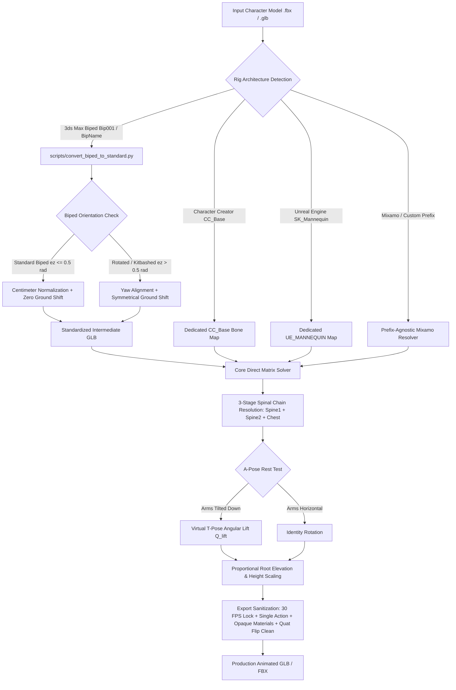

# The Retargeting Constitution & Technical Reference

> **Core Philosophy**: Never apply ad-hoc rig-specific hacks to the universal mathematical solver. Keep rig-specific format conversions isolated in dedicated pre-processing passes so that verified rigs (Mixamo T-Pose, A-Pose, Bipeds, Character Creator, Unreal Engine Mannequins, and Custom Rigs) remain permanently stable and mutually non-regressive.

---

## 1. System Architecture & Pipeline Overview

The retargeting pipeline transfers SOMA neural motion (`canonical_motion.glb`) onto arbitrary 3D character assets (`.fbx`, `.glb`, `.gltf`) through a multi-stage process:



---

## 2. Rig Preservation vs. Modernization Strategy

Our pipeline follows a strict **Native Rig Preservation** philosophy wherever possible, ensuring baked assets plug seamlessly into their target game engines and DCC suites:

| Rig Architecture | Handling Strategy | Engine Compatibility |
| :--- | :--- | :--- |
| **Unreal Engine Mannequin** (`SK_Mannequin` / UE4 & UE5) | **100% Native Preservation** (`pelvis`, `spine_01-03`, `thigh_l`, `upperarm_l`) | Drops directly into Unreal Engine 4 & 5 animation blueprints and IK retargeters. |
| **Character Creator** (CC3 / CC4 / Daz) | **100% Native Preservation** (`CC_Base_Hip`, `CC_Base_Waist`, `CC_Base_Spine01-02`) | Native compatibility with Character Creator 4, iClone, and Daz Studio. |
| **Mixamo & Standard Humanoid** | **100% Native Preservation** (`mixamorig:Hips` or custom prefix) | Instant drop-in for Unity Humanoid, Blender, Godot, and WebGL viewers. |
| **Custom-Prefixed Humanoids** (Custom Namespaces, Asset Packs) | **100% Native Preservation** (`<Prefix>_LeftArm`, `<Prefix>_Spine`) | Preserves original bone hierarchies while matching standardized joint endpoints. |
| **3ds Max Biped** (`Bip001`, `Bip<Name>`) | **Modernized to Standard Meters** | Converted to standard GLB to fix legacy 2000s centimeter roll & Inverse Bind Matrix bugs. |

---

## 3. Rig-Specific Constitutions & Approaches

### A. Mixamo Standard T-Pose (Standard Humanoid FBX/GLB)
- **Bone Convention**: `mixamorig:Hips`, `mixamorig:Spine`, `mixamorig:Spine1`, `mixamorig:Spine2`, `mixamorig:LeftArm`, `mixamorig:LeftUpLeg`, etc.
- **Local Axis Layout**: Local $+Y$ points along the bone length (longitudinal), $+Z$ is the forward bend normal.
- **3-Stage Spinal Chain**:
  - `Hips` $\to$ `mixamorig:Hips`
  - `Spine1` $\to$ `mixamorig:Spine` (Lower Lumbar)
  - `Spine2` $\to$ `mixamorig:Spine1` (Mid Thoracic)
  - `Chest` $\to$ `mixamorig:Spine2` (Upper Thoracic / Clavicle Base)
- **Critical Topology Rule**:
  - `mixamorig:LeftShoulder`, `mixamorig:RightShoulder`, and `mixamorig:Neck` attach directly to `mixamorig:Spine2`.
  - Omitting `Chest` $\to$ `mixamorig:Spine2` leaves the upper chest bone frozen at identity rotation, pulling the shoulders backward by $10\text{--}14\text{cm}$ and causing arms folded across the chest to sink into the torso mesh.

---

### B. Mixamo A-Pose (Angled Rest Pose Humanoid GLB/FBX)
- **Problem**: Rest pose arms are angled downward at $\approx 45^\circ - 50^\circ$. Applying SOMA's downward walking/running rotations compounds the angle to $-95^\circ$, causing the arms to cross behind the back and clip through the ribs.
- **Solution — Virtual T-Pose Lift ($Q_{\text{lift}}$)**:
  1. Measure the rest arm vector from shoulder to elbow:
     $$\vec{V}_{\text{left\_rest}} = \text{Elbow}_{\text{pos}} - \text{Shoulder}_{\text{pos}}$$
  2. Compute the rotation quaternion lifting the rest arm to horizontal:
     $$Q_{\text{left\_lift}} = \vec{V}_{\text{left\_rest}} \to (+1, 0, 0)$$
     $$Q_{\text{right\_lift}} = \vec{V}_{\text{right\_rest}} \to (-1, 0, 0)$$
  3. Pre-multiply the rest offset by $Q_{\text{lift}}$:
     $$M_{\text{offset}} = (M_{\text{src\_rest}})^{-1} \cdot (Q_{\text{lift}} \cdot M_{\text{tgt\_rest}})$$
- **Result**: The motion applies relative to a virtual horizontal T-pose, allowing the arms to swing naturally beside the waist and in front of the chest.

---

### C. Autodesk 3ds Max Character Studio Biped (Standard & Kitbashed Bipeds)
- **Signature**: Bones starting with `Bip` (e.g. `Bip001 Pelvis`, `Bip01 Pelvis`, `BipHero Pelvis`, `BipCharacter Spine`), parented to a $0.01$-scale `Point001` or `<name>_rigCharRoot` Empty.
- **Problem**: 3ds Max Bipeds use a centimeter coordinate system with $+X$ pointing along the bone length. Exporting directly to glTF invalidates the mesh Inverse Bind Matrices ($IBM$), resulting in mesh stretching between $-120\text{m}$ and $+40\text{m}$.
- **Solution (`scripts/convert_biped_to_standard.py`)**:
  1. **Universal Biped Prefix Resolution**: Strips custom prefixes (`BipCustom Pelvis` $\to$ `Bip001 Pelvis` $\to$ `mixamorig:Hips`) via `get_biped_mixamo_name()` to handle any custom-named Character Studio biped.
  2. **Standard vs. Rotated/Kitbashed Biped Branching**:
     - **Standard 3ds Max Bipeds (`ez <= 0.5 rad`)**:
       - `ground_shift = (0, 0, 0)` (**Zero offset — 100% native coordinate preservation**). Prevents floating/detached heads and torn jacket sleeves.
       - `R_yaw = Identity(4)`.
       - Vertices scaled by $0.01$ with zero artificial shifts.
     - **Rotated / Kitbashed Bipeds (`ez > 0.5 rad`)**:
       - `R_yaw = Rotation(yaw_corr, 'Z')` to align model facing forward along $-Y$.
       - `ground_shift` applied symmetrically to **both** skeleton joints and mesh vertices to keep head and body synchronized.
  3. **Standard Basis Transformation**:
     $$\mathbf{R}_{\text{basis}} = \begin{bmatrix} 0 & -1 & 0 \\ 1 & 0 & 0 \\ 0 & 0 & 1 \end{bmatrix}$$
     Maps 3ds Max Biped's $(+X \text{ longitudinal}, +Z \text{ up})$ into standard Mixamo's $(+Y \text{ longitudinal}, +Z \text{ forward})$.
  4. **3-Bone Spine Conversion**:
     - `Bip001 Spine` $\to$ `mixamorig:Spine`
     - `Bip001 Spine1` $\to$ `mixamorig:Spine1`
     - `Bip001 Spine2` $\to$ `mixamorig:Spine2`
  5. **Standard Armature Re-Skinning**: Attaches vertex groups to a clean `mixamorig` skeleton in true meters.

---

### D. Reallusion Character Creator 3 & 4 (Realistic, Stylized & Toon Characters)
- **Signature**: Bones starting with `CC_Base_` (`CC_Base_Hip`, `CC_Base_Waist`, `CC_Base_Spine01`, `CC_Base_Spine02`, `CC_Base_L_Clavicle`, etc.).
- **Critical Root Topology Rule**:
  - `CC_Base_Hip` is the **true root joint** (parent of both the spine and the legs via `CC_Base_Pelvis`).
  - SOMA `Hips` **must** map to `CC_Base_Hip`, **NOT** `CC_Base_Pelvis`.
  - Mapping to `CC_Base_Pelvis` leaves the root unrotated, creating a double-offset pelvis tilt that locks the legs in a straight ballerina stance.
- **Solution — Dedicated `CC_BASE_MAPPING`**:
  - `Hips` $\to$ `CC_Base_Hip`
  - `Spine1` $\to$ `CC_Base_Waist` (lower lumbar)
  - `Spine2` $\to$ `CC_Base_Spine01` (mid thoracic)
  - `Chest` $\to$ `CC_Base_Spine02` (upper thoracic; clavicles attach here!)
  - `Neck1` $\to$ `CC_Base_NeckTwist01`
  - `Head` $\to$ `CC_Base_Head`
  - `LeftShoulder` $\to$ `CC_Base_L_Clavicle`
  - `LeftArm` $\to$ `CC_Base_L_Upperarm`
  - `LeftForeArm` $\to$ `CC_Base_L_Forearm`
  - `LeftHand` $\to$ `CC_Base_L_Hand`
- **Thoracic Forward Flex Rule**:
  - Clavicles connect to `CC_Base_Spine02`. Driving `CC_Base_Spine02` with SOMA's forward thoracic flexion ensures clavicles and shoulders advance naturally, giving $10\text{--}14\text{cm}$ forward clearance and eliminating arm/forearm penetration into the ribcage/abdomen during folded-arm poses.
- **Twist Bones**: `CC_Base_L_ThighTwist01`, `CC_Base_L_CalfTwist01`, `CC_Base_L_UpperarmTwist01`, etc., inherit their transforms from their parent limb bones automatically.

---

### E. Unreal Engine Mannequins (`SK_Mannequin` / UE4 & UE5 Standard & Custom Mannequins)
- **Signature**: Bones using Unreal conventions (`pelvis`, `spine_01`, `spine_02`, `spine_03`, `clavicle_l`, `upperarm_l`, `lowerarm_l`, `hand_l`, `thigh_l`, `calf_l`, `foot_l`, `ball_l`).
- **Solution — Dedicated `UE_MANNEQUIN_MAPPING`**:
  - `Hips` $\to$ `pelvis`
  - `Spine1` $\to$ `spine_01`
  - `Spine2` $\to$ `spine_02`
  - `Chest` $\to$ `spine_03`
  - `Neck1` $\to$ `neck_01`
  - `Head` $\to$ `head`
  - `LeftShoulder` $\to$ `clavicle_l`
  - `LeftArm` $\to$ `upperarm_l`
  - `LeftForeArm` $\to$ `lowerarm_l`
  - `LeftHand` $\to$ `hand_l`
  - `LeftLeg` $\to$ `thigh_l`
  - `LeftShin` $\to$ `calf_l`
  - `LeftFoot` $\to$ `foot_l`
  - `LeftToeBase` $\to$ `ball_l`
- **Result**: 100% native preservation. Exports cleanly to GLB/FBX and imports directly into Unreal Engine 4 and 5 without bone remapping or IK rig restructuring.

---

### F. Custom-Prefixed Models (Custom Namespaces & Asset Store Packs)
- **Signature**: Standard humanoid hierarchies preceded by arbitrary model namespaces (e.g. `NPC_LeftUpLeg`, `Character1_RightArm`, `Hero_Spine`).
- **Solution — Prefix-Agnostic Matching**:
  - The resolver strips any leading namespace (`NPC_`, `Character1_`, `mixamorig:`) and matches against standardized suffixes (`leftupleg`, `leftleg`, `leftarm`, `rightarm`, etc.).
  - Priority matching ensures longer names (`LeftForeArm`) resolve before shorter substrings (`LeftArm`).

---

## 4. Verified Rig Architectures & Pipeline Categories

The retargeting pipeline is comprehensively verified across all primary industry humanoid rig architectures:

```text
Rig_Architectures/
├── 3dsMax_Biped/          [Standard & Kitbashed Bipeds, Bip001 / Bip<Custom> Rigs]
├── Character_Creator/     [CC3 / CC4 Dual-Hip, 3-Bone Spine & Toon Characters]
├── Mixamo/                [Standard Humanoid T-Pose & Angled A-Pose Rigs]
├── Unreal_Mannequin/      [SK_Mannequin UE4 / UE5 Humanoid Hierarchies]
└── Custom_Rigs/           [Custom Namespace Prefixes & Third-Party DCC Rigs]
```

---

## 5. Mathematical Grounding & Proportions Formula

To guarantee that characters with short legs (dwarves, stylized creatures) or long legs (tall humans) remain solidly planted on the floor grid ($Z \approx 0.02\text{m} - 0.04\text{m}$) without floating or sinking:

1. **Leg Length Ratio**:
   $$\text{scale\_ratio} = \frac{H_{\text{tgt\_leg}}}{H_{\text{soma\_leg}}} \quad \text{where } H_{\text{soma\_leg}} = 0.938\text{m}$$
   Clamped dynamically to safe range $[0.05, 10.0]$.
2. **Dynamic Root Translation**:
   $$\vec{P}_{\text{world\_hip}} = \begin{bmatrix} X_{\text{rest}} + X_{\text{soma}} \cdot \text{scale\_ratio} \\ Y_{\text{rest}} + Y_{\text{soma}} \cdot \text{scale\_ratio} \\ Z_{\text{rest}} + (Z_{\text{soma}} - H_{\text{soma\_leg}}) \cdot \text{scale\_ratio} \end{bmatrix}$$
- At rest ($Z_{\text{soma}} = H_{\text{soma\_leg}}$), the character stands at its authentic rest elevation ($Z_{\text{rest}}$).
- During jumps, walking strides, or crouches, vertical displacement scales proportionally around the character's natural stance.

---

## 6. WebGL Export & Timeline Sanitization

1. **Strict 30 FPS Lock**:
   ```python
   bpy.context.scene.render.fps = 30
   bpy.context.scene.render.fps_base = 1.0
   ```
   Prevents incoming FBX metadata (authored at 60 FPS, 75 FPS, or 120 FPS) from compressing the animation into fast-forward playback.
2. **Action Track Purging**:
   - All legacy pre-existing clips (`Idle`, `Run`, `T-Pose`) are deleted upon import.
   - Exactly **1 single clean `"Baked_Animation"` track** is exported.
3. **Material Alpha Sanitization**:
   - Disconnects alpha node links and sets `blend_method = 'OPAQUE'` to prevent see-through / X-ray sorting artifacts in Three.js and Babylon.js.
4. **Quaternion Flip Sanitization**:
   - Ensures consecutive keyframes follow shortest path: if $\mathbf{q}_k \cdot \mathbf{q}_{k-1} < 0$, negate $\mathbf{q}_k = -\mathbf{q}_k$. Eliminates 360° winding pops on joint channels.

---

## 7. Troubleshooting & Diagnostic Cheatsheet

| Symptom | Probable Cause | Corrective Action |
| :--- | :--- | :--- |
| **Arm/forearm penetrating body/torso during folds** | Upper thoracic spine bone (`Spine2` / `Spine02` / `spine_03`) unmapped; shoulder socket swung backward. | Map 3rd spine bone to `Chest` so thoracic forward flex is applied. |
| **Character floating above floor grid** | Absolute root height applied without subtracting $H_{\text{soma\_leg}}$. | Use $\Delta Z = (Z_{\text{soma}} - H_{\text{soma\_leg}}) \cdot \text{scale\_ratio}$. |
| **Hips buckled backward, knees locked straight** | Lower spine joint (`mixamorig:Spine` or `CC_Base_Waist`) unmapped and frozen at rest. | Verify `Spine1` maps to the lowest spine bone above the hips. |
| **Head detached from body / torn jacket sleeves on Biped** | Artificial grounding shift applied to bones while mesh remained at rest. | In `convert_biped_to_standard.py`, keep `ground_shift = (0,0,0)` for standard bipeds. |
| **Character rotates 90° sideways during animation** | Biped rest pose yaw offset improperly compensated. | Check Euler $Z$ rotation; apply $R_{\text{yaw}}$ only on rotated kitbashed bipeds. |
| **Hands crossing behind back (A-Pose)** | Downward walking motion compounding A-pose rest tilt. | Verify $Q_{\text{lift}}$ is active and rotating rest arm vector to horizontal. |
| **Mesh explodes / Spikes / Stretched underground** | FBX parent scale hierarchy desyncing Inverse Bind Matrices on glTF export. | Route model through `scripts/convert_biped_to_standard.py`. |
| **Animation plays in fast-forward (e.g. 1.98s)** | FBX scene metadata altered Blender's `scene.render.fps`. | Verify `render.fps = 30` lock is executed after importing target. |
| **Legs/Arms moving in reverse phase** | Generic substring matching swapped Left and Right limbs. | Ensure strict `left`/`l_` vs `right`/`r_` separation in bone resolver. |
| **Lower body static / not animating on Biped** | Custom Biped name (e.g. `BipCustom`) not recognized by default `Bip001` check. | Use `get_biped_mixamo_name()` and prefix-agnostic `bip` detection. |
| **404 error loading baked / preview model** | Space in filename was URL-encoded (`%20`) without decoding in backend server. | Ensure `urllib.parse.unquote()` is called across all API endpoints in `launch_gui.py`. |
