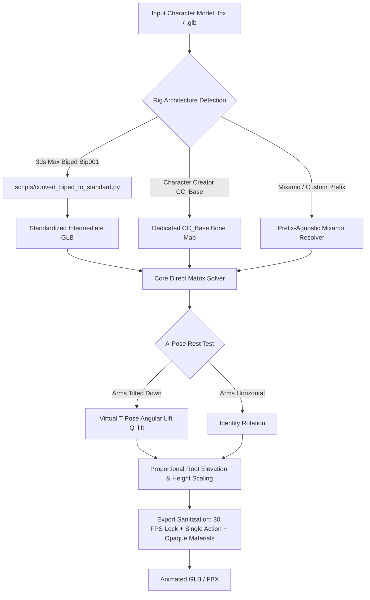

# The Retargeting Constitution & Technical Reference

> **Core Philosophy**: Never apply ad-hoc rig-specific hacks to the universal mathematical solver. Keep rig-specific format conversions isolated in dedicated pre-processing passes so that verified rigs (Mixamo T-Pose, A-Pose, Bipeds, Character Creator) remain permanently stable.

---

## 1. System Architecture & Pipeline Overview

The retargeting pipeline transfers SOMA neural motion (`canonical_motion.glb`) onto arbitrary 3D character assets (`.fbx`, `.glb`, `.gltf`) through a multi-stage process:



## 2. Rig Preservation vs. Modernization Strategy

Our pipeline follows a strict **Native Rig Preservation** philosophy wherever possible, ensuring baked assets plug seamlessly into their target engines:

| Rig Architecture | Handling Strategy | Engine Compatibility |
| :--- | :--- | :--- |
| **Unreal Engine Mannequin** (`SK_Mannequin`) | **100% Native Preservation** (`pelvis`, `thigh_l`, `upperarm_l`) | Drops directly into Unreal Engine 4 & 5 animation blueprints. |
| **Character Creator** (CC3 / CC4 / Daz) | **100% Native Preservation** (`CC_Base_Hip`, `CC_Base_Waist`) | Native compatibility with Character Creator 4, iClone, and Daz. |
| **Mixamo & Standard Humanoid** | **100% Native Preservation** (`mixamorig:Hips` or custom prefix) | Instant drop-in for Unity, Blender, and WebGL viewers. |
| **3ds Max Biped** (`Bip001`, `Bip<Name>`) | **Modernized to Standard Meters** | Converted to standard GLB to fix legacy 2000s centimeter roll bugs. |

---

## 3. Rig-Specific Constitutions & Rules

### A. Mixamo T-Pose (`Young-Pharaoh`, `Remy`, Standard FBX/GLB)
- **Bone Convention**: `mixamorig:Hips`, `mixamorig:Spine`, `mixamorig:LeftArm`, `mixamorig:LeftUpLeg`, etc.
- **Local Axis Layout**: Local $+Y$ points along the bone (longitudinal), $+Z$ is the forward bend normal.
- **Mapping Hierarchy**:
  - `Hips` $\to$ `mixamorig:Hips`
  - `Spine1` $\to$ `mixamorig:Spine` (Lower Lumbar)
  - `Spine2` $\to$ `mixamorig:Spine1` (Thoracic / Chest)
  - `LeftLeg` $\to$ `mixamorig:LeftUpLeg`
  - `LeftShin` $\to$ `mixamorig:LeftLeg`
  - `LeftFoot` $\to$ `mixamorig:LeftFoot`
  - `LeftToeBase` $\to$ `mixamorig:LeftToeBase`
- **Rule**: Do not remap `Spine1` directly to `mixamorig:Spine1` if `mixamorig:Spine` exists, as unmapped lower spine bones remain frozen and cause the hips to buckle backwards.

---

### B. Mixamo A-Pose (`Bastet-Animated-PBR.glb`)
- **Problem**: Rest pose arms are angled downward at $\approx 45^\circ - 50^\circ$. Applying SOMA's downward walking/running rotations compounds the angle to $-95^\circ$, causing the arms to cross behind the back and clip through the ribs.
- **Solution — Virtual T-Pose Lift ($Q_{\text{lift}}$)**:
  1. Measure the rest arm vector:
     $$\vec{V}_{\text{left\_rest}} = \text{Elbow}_{\text{pos}} - \text{Shoulder}_{\text{pos}}$$
  2. Compute the rotation quaternion lifting the rest arm to horizontal:
     $$Q_{\text{left\_lift}} = \vec{V}_{\text{left\_rest}} \to (+1, 0, 0)$$
     $$Q_{\text{right\_lift}} = \vec{V}_{\text{right\_rest}} \to (-1, 0, 0)$$
  3. Pre-multiply the rest offset by $Q_{\text{lift}}$:
     $$M_{\text{offset}} = (M_{\text{src\_rest}} \cdot Q_{\text{lift}})^{-1} \cdot M_{\text{tgt\_rest}}$$
- **Result**: The motion applies relative to a virtual horizontal T-pose, allowing the arms to swing naturally beside the waist and in front of the chest.

---

### C. Autodesk 3ds Max Biped (`Glow_Idle.fbx`, `trump_lp_anim_iddle01.fbx`, `Bip001` / `Bip01` / `Bip<Name>`)
- **Signature**: Bones starting with `Bip` (e.g. `Bip001 Pelvis`, `Bip01 Pelvis`, `BipTrump Pelvis`, `BipHero Spine`), parented to a $0.01$-scale `Point001` or `<name>_rigCharRoot` Empty.
- **Problem**: 3ds Max Bipeds use a centimeter coordinate system with $+X$ pointing along the bone length. Exporting directly to glTF invalidates the mesh Inverse Bind Matrices ($IBM$), resulting in mesh stretching between $-120\text{m}$ and $+40\text{m}$.
- **Solution (`scripts/convert_biped_to_standard.py`)**:
  1. **Universal Biped Prefix Resolution**: Strips custom prefixes (`BipTrump Pelvis` $\to$ `Bip001 Pelvis` $\to$ `mixamorig:Hips`) to map any custom-named Character Studio biped seamlessly.
  2. **Centimeter Normalization**: Scale vertex coordinates by $0.01$ ($186\text{cm} \to 1.86\text{m}$) and bake into world coordinates.
  3. **Standard Basis Transformation**:
     $$\mathbf{R}_{\text{basis}} = \begin{bmatrix} 0 & -1 & 0 \\ 1 & 0 & 0 \\ 0 & 0 & 1 \end{bmatrix}$$
     Maps 3ds Max Biped's $(+X \text{ longitudinal}, +Z \text{ up})$ into standard Mixamo's $(+Y \text{ longitudinal}, +Z \text{ forward})$.
  4. **Standard Armature Re-Skinning**: Attach vertex groups to a clean `mixamorig` skeleton in true meters.

---

### D. Reallusion Character Creator 3 / 4 (`man3.Fbx`, `CC_Base`)
- **Signature**: Bones starting with `CC_Base_` (e.g., `CC_Base_Hip`, `CC_Base_Pelvis`, `CC_Base_L_Thigh`).
- **Critical Topology Rule**:
  - `CC_Base_Hip` is the **true root joint** (parent of both the spine and the legs via `CC_Base_Pelvis`).
  - SOMA `Hips` **must** map to `CC_Base_Hip`, **NOT** `CC_Base_Pelvis`.
  - Mapping to `CC_Base_Pelvis` leaves the root unrotated, creating a double-offset pelvis tilt that locks the legs in a straight ballerina stance.
- **Twist Bones**: `CC_Base_L_ThighTwist01`, `CC_Base_L_CalfTwist01`, etc., inherit their transforms from their parent limb bones automatically.

---

### E. Custom-Prefixed Models (`Bear_Big.fbx`, Asset Store Packs)
- **Signature**: Standard humanoid hierarchies preceded by arbitrary model namespaces (e.g. `Bear_Mama_LeftUpLeg`, `Character1_RightArm`, `Hero_Spine`).
- **Solution — Prefix-Agnostic Matching**:
  - The resolver strips any leading namespace (`Bear_Mama_`, `Character1_`, `mixamorig:`) and matches against standardized suffixes (`leftupleg`, `leftleg`, `leftarm`, `rightarm`, etc.).
  - Priority matching ensures longer names (`LeftForeArm`) resolve before shorter substrings (`LeftArm`).

---

### F. Unreal Engine Mannequins (`SK_Mannequin` / UE4 & UE5, `cgtrader_optimized_SKM_XSENS_Mannequin.fbx`)
- **Signature**: Bones using Unreal conventions (`pelvis`, `spine_01`, `spine_02`, `clavicle_l`, `upperarm_l`, `lowerarm_l`, `hand_l`, `thigh_l`, `calf_l`, `foot_l`, `ball_l`).
- **Solution — Dedicated `UE_MANNEQUIN_MAPPING`**:
  - `Hips` $\to$ `pelvis`
  - `Spine1` $\to$ `spine_01`
  - `Spine2` $\to$ `spine_02`
  - `LeftLeg` $\to$ `thigh_l`
  - `LeftShin` $\to$ `calf_l`
  - `LeftFoot` $\to$ `foot_l`
  - `LeftToeBase` $\to$ `ball_l`
  - `LeftArm` $\to$ `upperarm_l`
  - `LeftForeArm` $\to$ `lowerarm_l`
- **Result**: Native, seamless retargeting onto Unreal Engine 4 and 5 characters.

---

## 3. Mathematical Grounding & Proportions Formula

To guarantee that characters with short legs (dwarves, stylized creatures) or long legs (tall humans) remain solidly planted on the floor grid ($Z \approx 0.02\text{m} - 0.04\text{m}$) without floating or sinking:

1. **Leg Length Ratio**:
   $$\text{scale\_ratio} = \frac{H_{\text{tgt\_leg}}}{H_{\text{soma\_leg}}} \quad \text{where } H_{\text{soma\_leg}} = 0.938\text{m}$$
2. **Dynamic Root Translation**:
   $$\vec{P}_{\text{world\_hip}} = \begin{bmatrix} X_{\text{rest}} + X_{\text{soma}} \cdot \text{scale\_ratio} \\ Y_{\text{rest}} + Y_{\text{soma}} \cdot \text{scale\_ratio} \\ Z_{\text{rest}} + (Z_{\text{soma}} - H_{\text{soma\_leg}}) \cdot \text{scale\_ratio} \end{bmatrix}$$
- At rest ($Z_{\text{soma}} = H_{\text{soma\_leg}}$), the character stands at its authentic rest elevation ($Z_{\text{rest}}$).
- During jumps, walking strides, or crouches, vertical displacement scales proportionally around the character's natural stance.

---

## 4. WebGL Export & Timeline Sanitization

1. **Strict 30 FPS Lock**:
   ```python
   bpy.context.scene.render.fps = 30
   bpy.context.scene.render.fps_base = 1.0
   ```
   Prevents incoming FBX metadata (authored at 60 FPS, 75 FPS, or 120 FPS) from compressing the animation into fast-forward playback.
2. **Action Track Purging**:
   - All legacy pre-existing clips (`Idle`, `Run`, `T-Pose`) are deleted upon import.
   - Exactly **1 single clean `"Baked_Animation"` track** is exported.
3. **Material Alpha Sanitization**:
   - Disconnects alpha node links and sets `blend_method = 'OPAQUE'` to prevent see-through / X-ray sorting artifacts in Three.js and Babylon.js.

---

## 5. Troubleshooting & Diagnostic Cheatsheet

| Symptom | Probable Cause | Corrective Action |
| :--- | :--- | :--- |
| **Character floating above floor grid** | Absolute root height applied without subtracting $H_{\text{soma\_leg}}$. | Use $\Delta Z = (Z_{\text{soma}} - H_{\text{soma\_leg}}) \cdot \text{scale\_ratio}$. |
| **Hips buckled backward, knees locked straight** | Lower spine joint (`mixamorig:Spine` or `CC_Base_Waist`) unmapped and frozen at rest. | Verify `Spine1` maps to the lowest spine bone above the hips. |
| **Hands crossing behind back (A-Pose)** | Downward walking motion compounding A-pose rest tilt. | Verify $Q_{\text{lift}}$ is active and rotating rest arm vector to horizontal. |
| **Mesh explodes / Spikes / Stretched underground** | FBX parent scale hierarchy desyncing Inverse Bind Matrices on glTF export. | Route model through `scripts/convert_biped_to_standard.py`. |
| **Animation plays in fast-forward (e.g. 1.98s)** | FBX scene metadata altered Blender's `scene.render.fps`. | Verify `render.fps = 30` lock is executed after importing target. |
| **Legs/Arms moving in reverse phase** | Generic substring matching swapped Left and Right limbs. | Ensure strict `left`/`l_` vs `right`/`r_` separation in bone resolver. |
| **Lower body static / not animating on Biped** | Custom Biped name (e.g. `BipTrump`) not recognized by default `Bip001` check. | Use `get_biped_mixamo_name()` and prefix-agnostic `bip` detection. |
| **404 error loading baked / preview model** | Space in filename was URL-encoded (`%20`) without decoding in backend server. | Ensure `urllib.parse.unquote()` is called across all API endpoints in `launch_gui.py`. |
